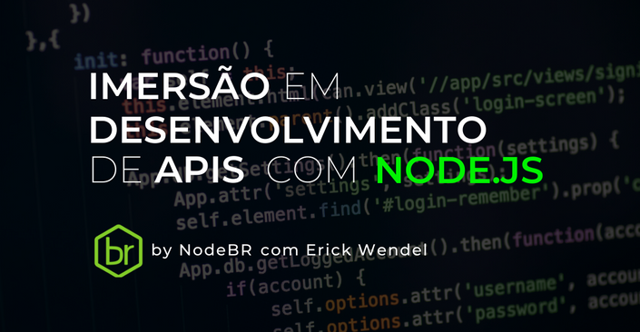

<!-- @import "[TOC]" {cmd="toc" depthFrom=1 depthTo=6 orderedList=false} -->
# Curso Node

 <h2>Imersão em desenvolvimento de APIS com NODE.JS </h2>
 
 <h3>Curso por Erick Wendel</h3>

 [Link do Curso](https://erickwendel.teachable.com/)

 
 

 
 
 <h4>Descrição</h4> 

Este projeto é conteúdo replicado do curso de Node do <a href=https://www.linkedin.com/in/erickwendel/ target="_blank">[Erick Wendel]</a>, o curso é voltado para os devs já iniciantes com JavaScript e que querem aprender a usar novas técnicas e aperfeiçoar a criação das suas api com node, será apresentado TDD, Docker e uso de bancos NOSQL como o MongoDB. </a> 

<h4> Sobre o proejeto</h4>

### Projeto construído com:
- Node
 -Docker
 -Postgre
  
 ## Libs e dependências utilizadas :books:

- [Node](https://nodejs.org/en/): versão 12.18.13

## Como executar o projeto na sua máquina :gear:

<h5>Node</h5>

1 - Instalar a node na máquina.

2 - Instalar as depêndencias:

#Instalar modulos de rotas do app

	Npm init -y
			

## Possíveis Erros :triangular_flag_on_post:

#Instalando as depêndencias do projeto - Erro de tipagem: 
 -Executar: Npm install 

